# Avanza Stock Finder — App Guide

A visual tour of every screen in the app, with screenshots. All screenshots were captured from a local development build seeded with the bundled mock dataset (15 large-cap stocks with realistic fundamentals), so numbers shown are demo data — see [STOCK_DATA_CONFIG.md](../backend/STOCK_DATA_CONFIG.md) for how data sources are configured.

For setup instructions see [QUICK_START.md](../QUICK_START.md). For architecture see [docs/architecture/overview.md](architecture/overview.md), and for how scores are computed see [SCORING_METHODOLOGY.md](../backend/SCORING_METHODOLOGY.md).

---

## Contents

1. [Browse Stocks (Home)](#1-browse-stocks-home)
2. [Strategy Screener](#2-strategy-screener)
3. [Stock Detail](#3-stock-detail)
4. [Leaderboard](#4-leaderboard)
5. [Watchlists](#5-watchlists)
6. [What Changed](#6-what-changed)
7. [Compare](#7-compare)
8. [Portfolio](#8-portfolio)
9. [Learning Lab](#9-learning-lab)
10. [Glossary](#10-glossary)
11. [Learning Mode](#11-learning-mode)

---

## 1. Browse Stocks (Home)

**Route:** `/`

The home page is the entry point to the app. It shows the full stock universe as cards with sector, industry, market cap, and exchange. From here you can:

- **Search** stocks by ticker or name.
- **Filter** by sector with the dropdown.
- **Add to a watchlist** with the star button on any card.
- **Open a stock's detail page** by clicking its card.

The header navigation reaches every other page, and the **Learn** toggle (top right) turns on Learning Mode anywhere in the app.

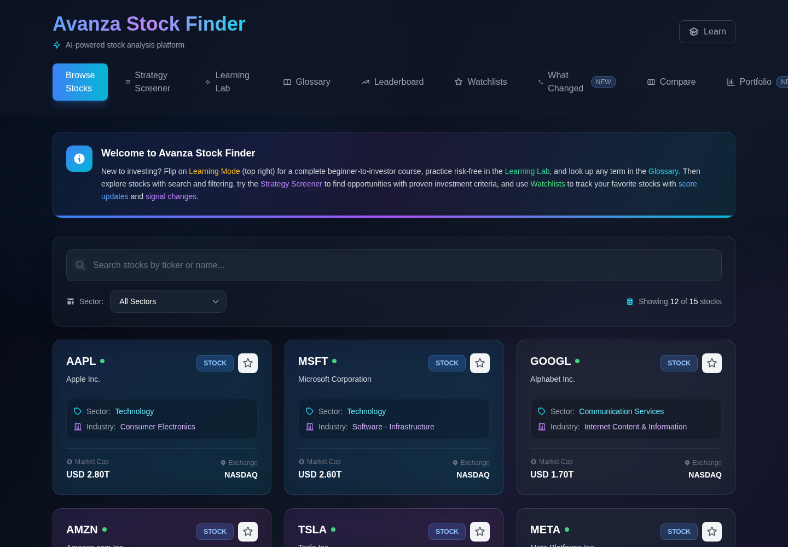

## 2. Strategy Screener

**Route:** `/screener`

Five pre-built investment strategies, each encoding a proven set of screening criteria:

| Strategy | Criteria | Style |
|---|---|---|
| 💎 Value Gems | P/E < 15 · ROIC > 15% · D/E < 0.5 | Long-term value investing |
| 🚀 Quality Compounders | ROIC > 20% · Net margin > 15% · growing revenue | Wealth compounding |
| 👑 Dividend Kings | Yield > 3% · payout < 70% · healthy balance sheet | Income + stability |
| 🔍 Deep Value | P/B < 2.0 · FCF yield > 3% · D/E < 1.0 | Contrarian value |
| ⚡ Explosive Growth | Revenue growth > 30% · PEG < 2.0 · positive margins | Growth at reasonable price |

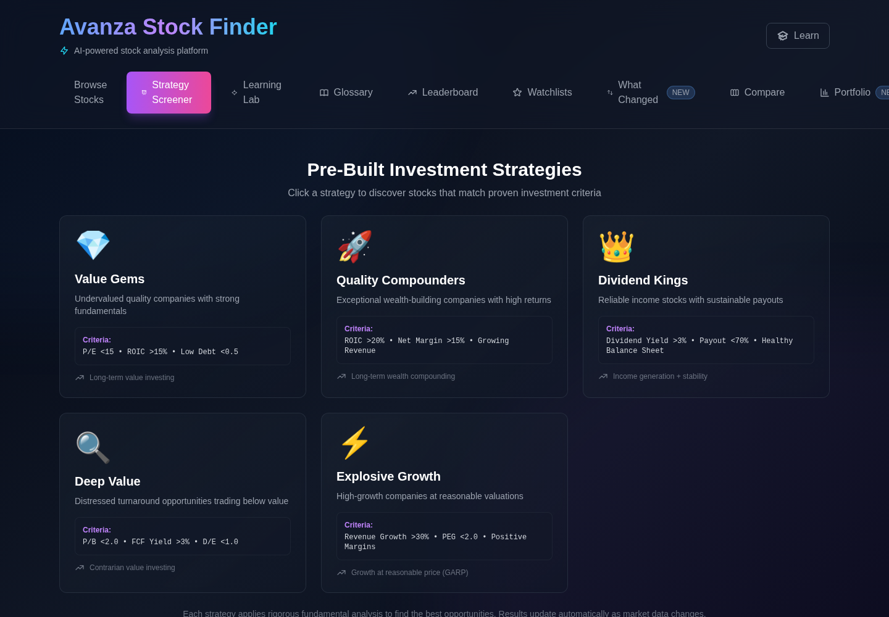

Clicking a strategy runs it against the stock universe and lists the matches in a sortable results table, with expandable rows for details:

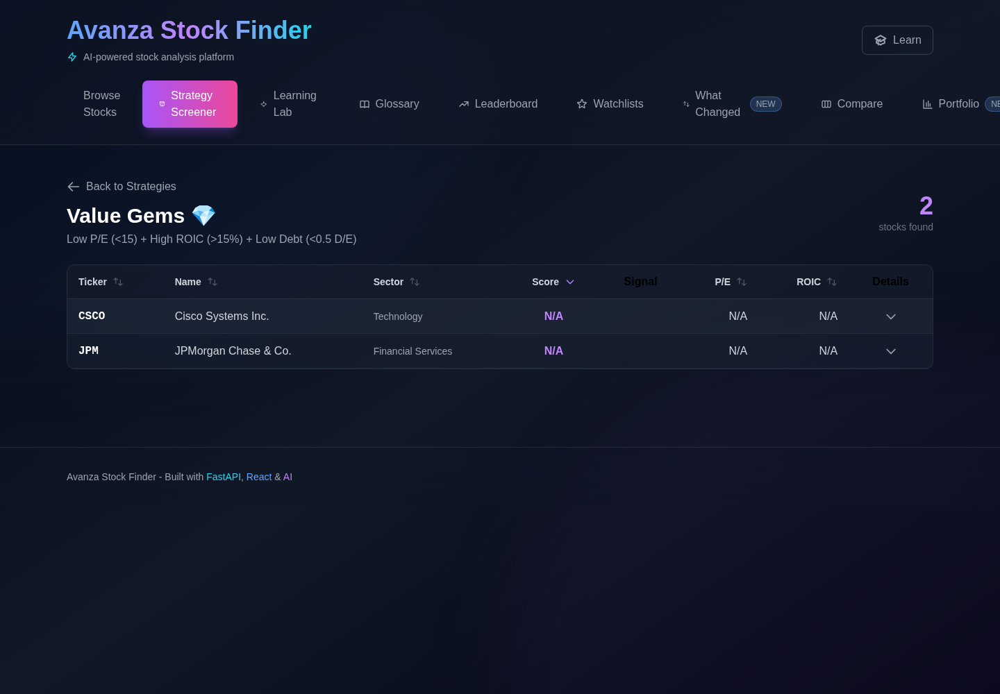

## 3. Stock Detail

**Route:** `/stock/:ticker`

The deep-analysis page for a single stock. Tabs across the top switch between **Overview**, **Charts** (price, RSI, volume), **Fundamentals**, and **Score Analysis**. The overview shows:

- Headline stats: total score (0–100), market cap, P/E ratio, dividend yield.
- A 7-day score-change badge under the ticker.
- **Score Breakdown** radar chart splitting the total into the four factors — Value, Quality, Momentum, and Financial Health (0–25 points each) — with the resulting buy/sell signal badge.
- Strengths, weaknesses, and plain-language reasoning behind the score (further down the page).

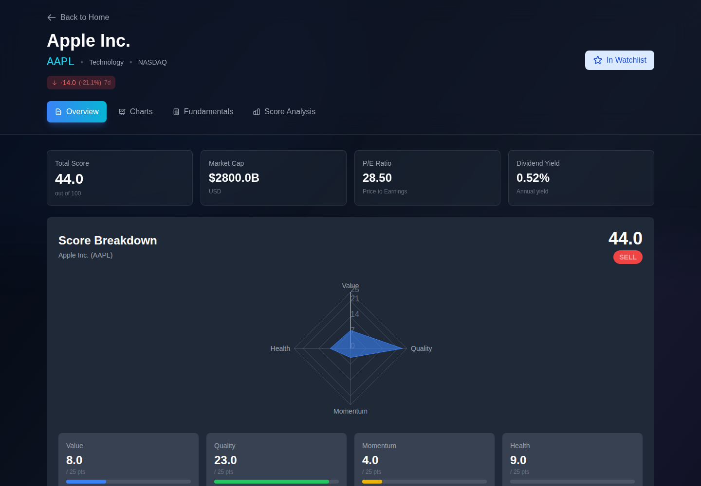

## 4. Leaderboard

**Route:** `/leaderboard`

Ranks the whole universe by total score. Three views:

- **Top Stocks** — highest overall scores across all factors.
- **By Signal** — filter stocks by buy/sell signal (STRONG BUY → STRONG SELL).
- **By Sector** — top performers within each sector.

Each row breaks the score into its Value / Quality / Momentum / Health components, color-coded by strength.

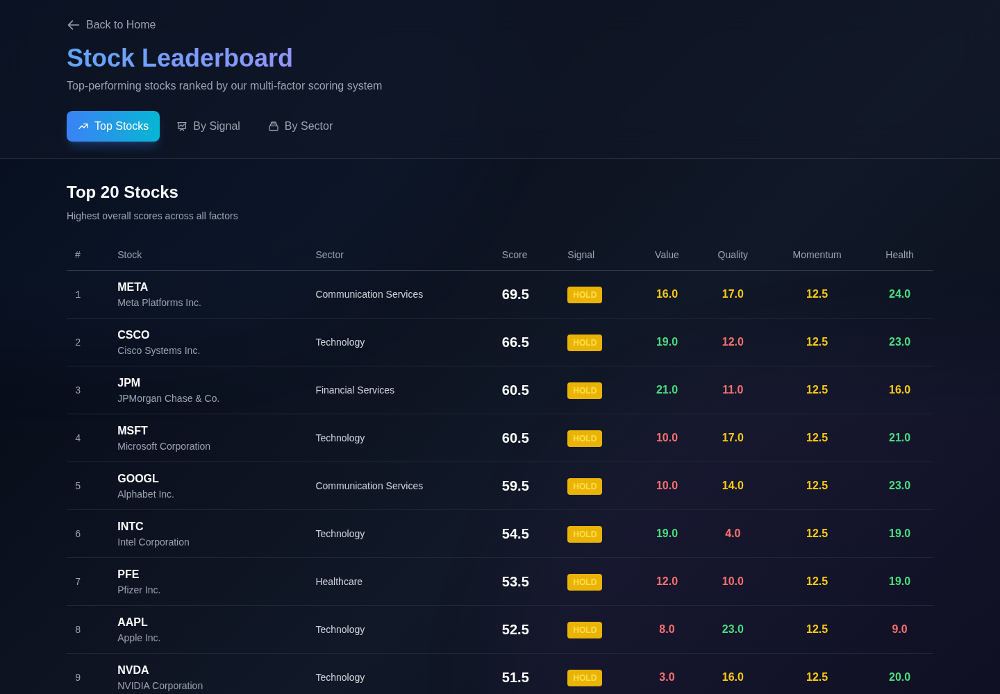

## 5. Watchlists

**Route:** `/watchlists`

Create any number of named watchlists and add stocks from the home page's star button (or a stock detail page). Each entry shows the stock's current sector, market cap, and 7-day score change, with a shortcut to its detail page. Watchlists are stored in your browser's local storage.

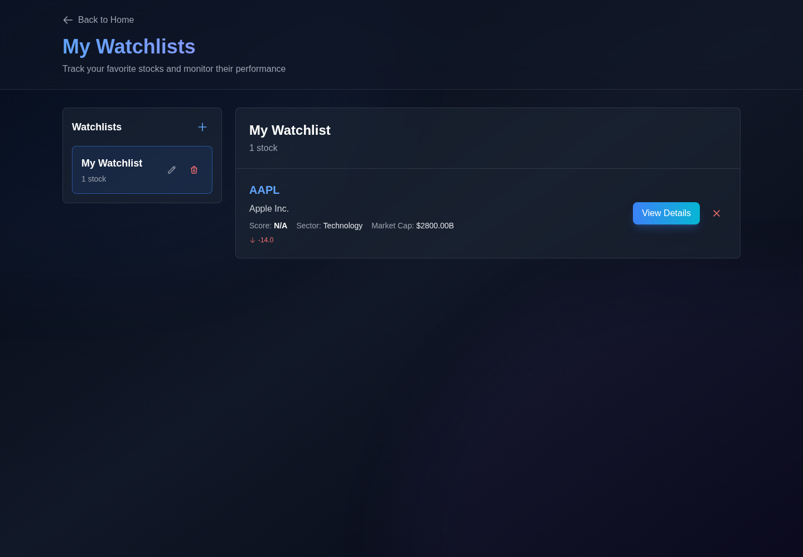

## 6. What Changed

**Route:** `/weekly-changes`

A change-tracking dashboard built on daily score snapshots. Switch between 7-, 30-, and 90-day windows to see:

- **Top Gainers / Top Losers** — the biggest score moves, with previous vs. current score and signal.
- **Signal Changes** — stocks whose buy/sell signal flipped in the period, with the transition (e.g. STRONG SELL → SELL) called out.
- **Summary stats** — biggest gainer, biggest loser, and total signal changes.

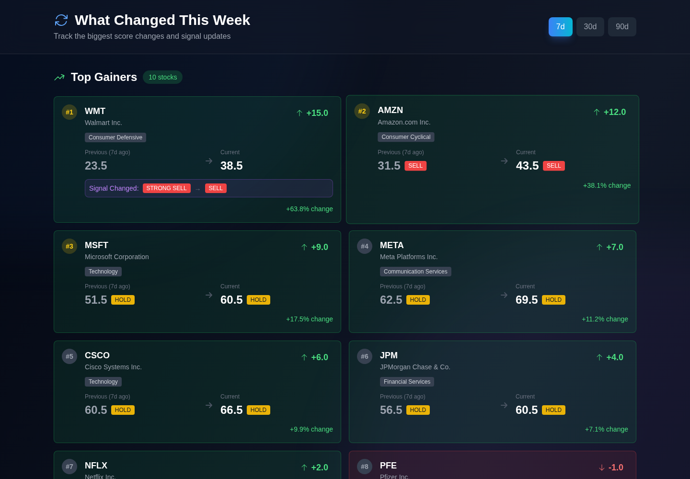

## 7. Compare

**Route:** `/compare`

Puts up to four stocks side by side across scores, valuation, profitability, growth, and balance-sheet metrics. The best value in each row is highlighted in green, direction-aware: lower is better for P/E and debt, higher is better for ROIC and margins. The comparison set persists across page refreshes.

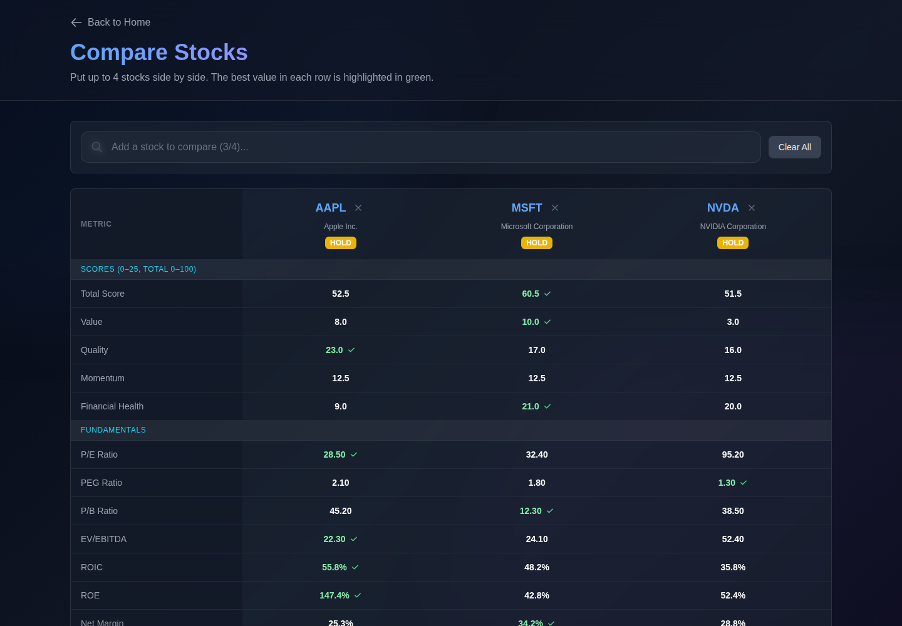

## 8. Portfolio

**Route:** `/portfolio`

Track positions you actually own — ticker, share count, and average buy price (stored locally in your browser). Each holding is run through the scoring engine, and the page summarizes portfolio health:

- **Total cost basis** and position count.
- **Cost-weighted average score** across holdings.
- **Signal mix** and **sector allocation** by cost.
- **Positions to review** — flags any holding sitting on a SELL signal.

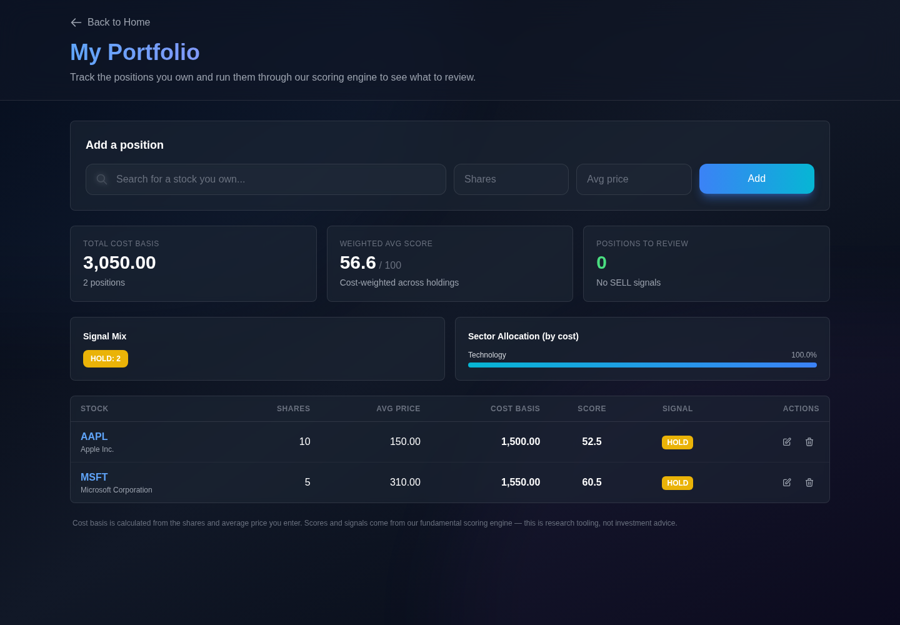

## 9. Learning Lab

**Route:** `/learning-lab`

A risk-free paper-trading environment with a $100,000 practice balance. A guided six-step flow teaches the decision process in plain language — pick a company, write an investment thesis, set a plan — and the term for each concept is introduced only after you've used it. The Learning Dashboard tracks practice plans made, trades reviewed, and your average win/loss, turning sell reviews into feedback.

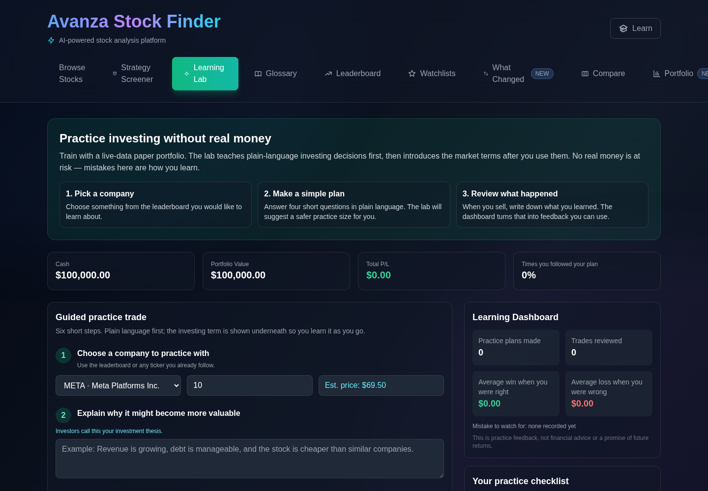

## 10. Glossary

**Route:** `/glossary`

120+ investing terms in plain language, each with a concrete example. Searchable, and browsable by category: Basics, Trading & Orders, Fundamental Analysis, Technical Analysis, Portfolio & Risk, Funds & Dividends, and Strategy & Psychology.

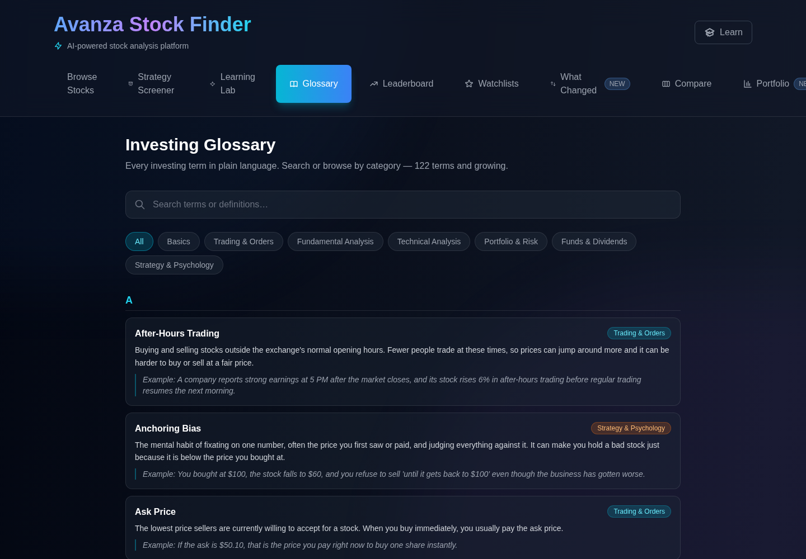

## 11. Learning Mode

**Toggle:** the **Learn** button in the header, available on every page.

Learning Mode overlays a complete beginner-to-investor curriculum on top of the app: a sidebar tracks progress through 15 modules (Stock Market Foundations through investment strategies), and lesson content opens in a reader with key terms and a quiz per module. Modules unlock in order, and progress is saved locally.

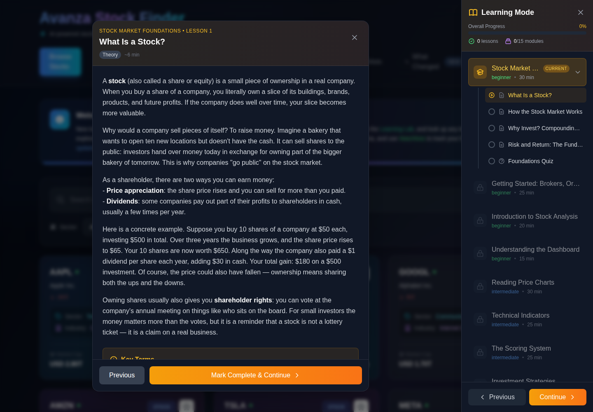

---

## Regenerating these screenshots

The screenshots live in `docs/screenshots/`. To regenerate them:

1. Start the backend (`./run_backend.sh`) and frontend (`./run_frontend.sh`), and seed the database (`python backend/seed_data.py`).
2. The **What Changed** page needs score history: call `ScoreTrackingService.snapshot_all_scores()` on two different dates (in normal operation the daily snapshot task builds this history over time).
3. Drive the app at `http://localhost:3000` with a headless browser (e.g. Playwright at 1440×1000) and screenshot each route listed above. Watchlist, Compare, and Portfolio content is populated through the UI since it lives in browser local storage.
